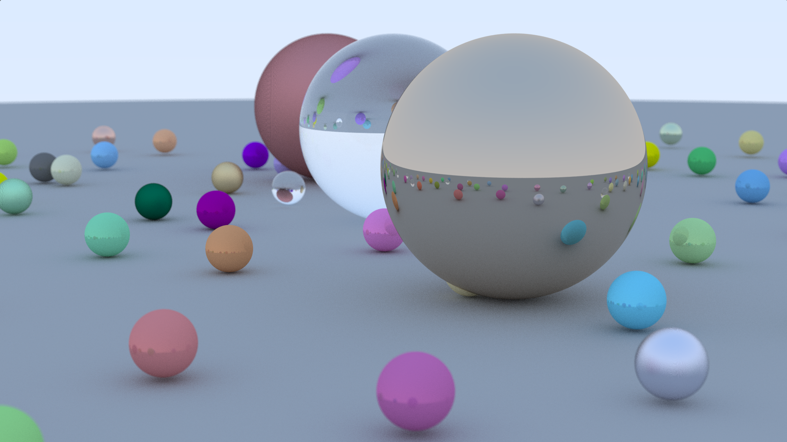

# Ray Tracing Shader in GLSL

This repository contains a GLSL shader implementation of a ray tracer with support for multiple material types, depth of field, and a scene composed of spheres. The code is designed to render a 3D scene with realistic lighting effects, including Lambertian diffuse, metallic reflections, and dielectric refraction.

## Features

- **Ray Tracing**: Implements a path-tracing algorithm.
- **Materials**:
  - Lambertian (diffuse)
  - Metal (reflective with adjustable fuzziness)
  - Dielectric (transparent with refraction, using Schlick's approximation for reflectance)
- **Scene**: A predefined scene with 99 spheres, including a large ground plane and various smaller spheres with different materials and colors.
- **Depth of Field**: Simulates camera aperture and focus distance for realistic blur effects.
- **Anti-Aliasing**: Uses multiple samples per pixel (`SAMPLES_PER_PIXEL = 16`, use higher value for better image) with pseudo-random sampling for smoother results.

## Prerequisites

This shader is written in GLSL (OpenGL Shading Language) and is intended to run in an environment that supports fragment shaders, such as:
- [Shadertoy](https://www.shadertoy.com/) (where it can be directly pasted and run)
- A custom OpenGL/WebGL application with a fragment shader setup

You’ll need:
- A GPU that supports GLSL
- A platform to execute the shader (e.g., Shadertoy, a WebGL canvas, or an OpenGL application)

## Usage

### Running in Shadertoy
You can view it directly from the [link](https://www.shadertoy.com/view/3cSGRc). 
Or You can:
1. Copy the entire code from the file.
2. Go to [Shadertoy](https://www.shadertoy.com/new).
3. Paste the code into the editor.
4. Click the "Compile" button (play icon) to render the scene.

## Code Structure

- **Constants**: 
  - `PI`: Mathematical constant for calculations.
  - `SAMPLES_PER_PIXEL`: Number of samples for anti-aliasing (default: 16). Use higher value for better results.
  - `MAX_RAY_BOUNCES`: Maximum number of ray bounces (default: 20).
- **Random Functions**: 
  - `hash12`, `hash22`, `hash32`: Generate pseudo-random numbers/vectors.
  - `random_in_unit_sphere`, `random_unit_vector`, `random_in_unit_disk`: Generate random directions for scattering and depth of field.
- **Structures**: 
  - `ray`: Represents a ray with origin and direction.
  - `material`: Defines material properties (type, albedo, fuzz, refraction index).
  - `hit_record`: Stores intersection data (point, normal, distance, material).
  - `sphere`: Defines a sphere with center, radius, and material.
- **Scene Definition**: 
  - An array of 99 spheres (`spheres`) with predefined positions, sizes, and materials.
- **Core Functions**:
  - `hit_sphere`: Computes ray-sphere intersections.
  - `hit`: Checks for intersections with all spheres in the scene.
  - `scatter`: Handles material-specific ray scattering (Lambertian, metal, dielectric).
  - `ray_color`: Traces rays and computes final color with bounces.
  - `mainImage`: Sets up the camera, performs rendering with anti-aliasing, and outputs the final color.

## 🌍 Scene Description

The scene includes:
- **Ground Sphere**: A large Lambertian sphere with a radius of `1000`, centered at `y = -1000`, acting as the ground.
- **Main Spheres**:
  - **Dielectric Sphere** (glass-like): Center at `(0, 1, 0)`, radius `1`.
  - **Metallic Sphere (Polished)**: Center at `(-4, 1, 0)`, radius `1`, fuzziness = `0`.
  - **Metallic Sphere (Rougher Surface)**: Center at `(4, 1, 0)`, radius `1`, fuzziness = `1`.
- **Scattered Spheres**:
  - **96 smaller spheres** (`radius = 0.2`) randomly placed around the scene.
  - Materials include **Lambertian (diffuse), metal (reflective), and dielectric (transparent)** with various colors.

## 📷 Camera Settings
- **Position**: `(-13, 2, -3)`
- **LookAt Target**: `(0, 0, 0)`
- **Field of View**: `20°`
- **Aperture**: Small (for depth-of-field effects)

## 🖼️ Rendered Image
The image below was generated with **SAMPLES_PER_PIXEL = 100**, producing a smooth and realistic output.

## Customization

- **Camera Settings**: Modify `lookfrom`, `lookat`, `vfov`, `aperture`, or `focus_dist` in `mainImage` to change the viewpoint or depth of field.
- **Scene**: Edit the `spheres` array to add, remove, or modify objects (positions, radii, materials).
- **Sampling**: Adjust `SAMPLES_PER_PIXEL` for quality vs. performance trade-offs (higher values improve quality but slow rendering).
- **Materials**: Tweak material properties (e.g., `albedo`, `metal_fuzz`, `dielectric_index_of_refraction`) in the `spheres` array.
